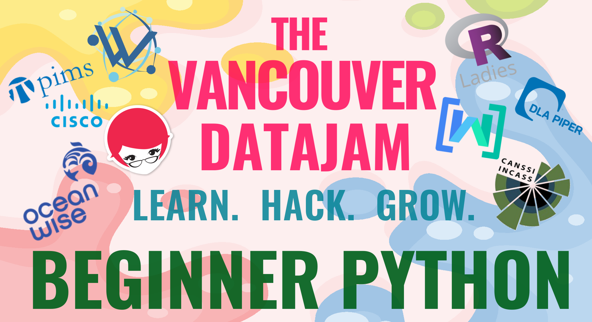

# Intro to Data Analysis with Python

## Vancouver Datajam 2021 Workshop

This beginner level workshop will introduce data analysis with Python, focusing on Jupyter notebooks, working with data in Pandas, and visualization with Seaborn. A familiarity with Python basics will help you get the most out of this workshop, but you do not need any prior experience with Pandas or any other libraries.

### Lessons

The lessons are available online **[here](https://jenfly.github.io/datajam-python/0-jupyter.html)**.

### Setup

We'll be using Python 3.8, Jupyter Notebook, Pandas, Seaborn, and Plotly. You can work through the lessons and exercises online, without installing any software on the computer (see the `#python-beginner` channel in Discord for info). If you'd like to install Python on your computer, please **[click here](https://jenfly.github.io/datajam-python/SETUP)** for instructions.

### Tentative Schedule

- 1:00 Intro to Jupyter (35 min)
- 1:35 Intro to Pandas (20 min)
- 1:55 Break (10 min)
- 2:05 Intro to Pandas cont'd (45 min)
- 2:50 Break (10 min)
- 3:00 Intro to Visualization (60 min)

### Credits

Some portions of this workshop are adapted from the following instructional materials:
- [U of T Coders Data Carpentry Workshop](https://github.com/UofTCoders/2018-09-10-utoronto)
- [UBC R Study Group Workshop](https://github.com/travis-m-blimkie/introrworkshop)

[Datajam main page](https://www.vancouverdatajam.ca/)
