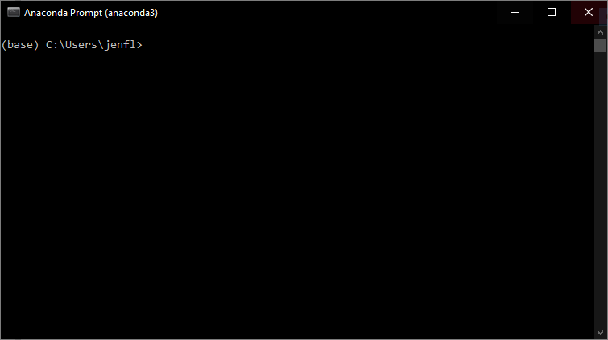
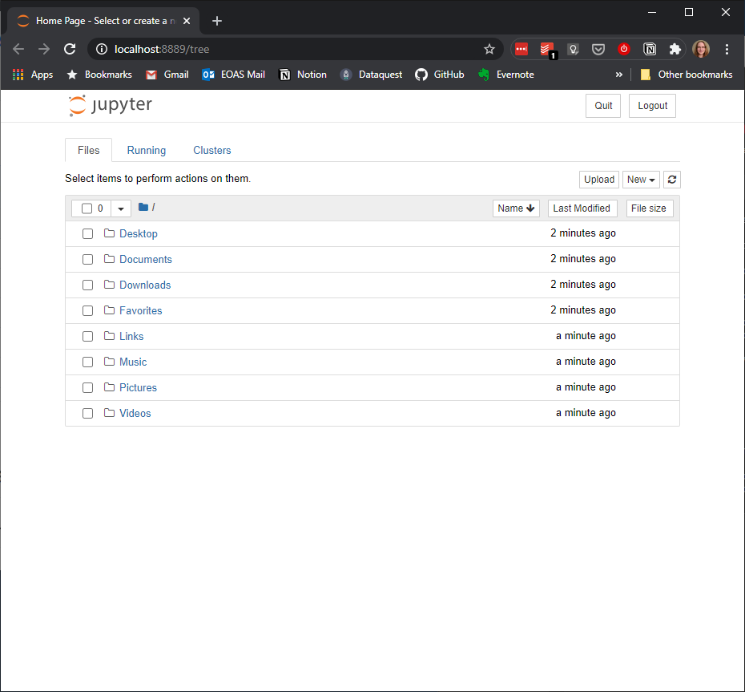

# Computer Setup Instructions

We will be using a program called Jupyter as our development environment for the workshop. I recommend using Anaconda or Miniconda to install Jupyter and Python. These are Python distributions which include core Python plus a package manager (`conda`) to manage all the 3rd party libraries you'll need for data analysis.

> Note: Any existing system-wide Python installation on your computer won't be affected by installing Anaconda/Miniconda with the recommended default settings, as the distribution will be self-contained within your home directory.


Below are a few different options for setting up your computer. You'll want to have the software installed and working properly before the workshop starts. Sometimes a few minor tweaks are needed to get the software working on different systems, so if you have any problems please email me (jenfly [at] gmail [dot] com) or ask for help at the workshop.


We have three options for this step. Jump to:
- [Option A: Full Anaconda Distribution](#anaconda)
- [Option B: Miniconda](#miniconda)
- [Option C: pip](#pip)

<a id="anaconda"></a>
### Option A: Full Anaconda Distribution

This option is the easiest to set up and start using. The full Anaconda distribution includes Python, Jupyter, and hundreds of other popular scientific libraries&mdash;you'll immediately have access to all these libraries without having to find and install them yourself. With this option, you can use the graphical interface (Anaconda Navigator) to launch JupyterLab and manage libraries, or you can work from the command line, if you prefer.


#### 1. Download and Install Anaconda

Click "Download" on the **[Anaconda download page](https://www.anaconda.com/download/)** and select the Python 3.8 installer for your operating system (Windows users, if you're unsure whether you have 64-bit or 32-bit version of Windows, [follow these instructions to find out](https://support.microsoft.com/en-ca/help/15056/windows-32-64-bit-faq)).  After the download finishes, run the installer, making sure to use all the recommended default settings. We won't be using Microsoft Visual Studio Code, so when the installer asks if you want to install it, you can just click "Skip". For more details on the intallation steps, you can check out the instructions for [Windows](https://docs.anaconda.com/anaconda/install/windows), [Mac](https://docs.anaconda.com/anaconda/install/mac-os), or [Linux](http://docs.anaconda.com/anaconda/install/linux/).

> Note: The Windows installer says 3 GB free space is required, but on my computer I found that the software uses almost double that. These numbers might be a bit different on Mac or Linux.

#### 2. Install Plotly (Optional)

We may be using the `plotly` library briefly, depending on time. To install, follow the instructions below, otherwise **[jump to the next step](#navigator_test)**.
  
If you're on Windows, look for a newly installed program called "Anaconda Prompt" and run it to open up a console similar to the screenshot below. If you're on a Mac, look for a program called "Terminal" in the Launchpad, and run it to open a console window.
    

    
In either the Windows or the Mac version of the console, type the following command, press `Enter`, and follow the prompts to install `plotly`.
```
conda install -c plotly plotly
```

<a id="navigator_test"></a>
#### 3. Test Your Installation

Look for a newly installed program called "Anaconda Navigator" in your computer's menu, and click to open it. It might take a minute to initialize, and a few other windows might open and close while it's doing so, this is all normal. A window similar to the screenshot below should open up. If so, you're all set! You can exit by selecting File-> Quit from the top menu.


[back to workshop main page](https://jenfly.github.io/datajam-python/)


<a id="miniconda"></a>
### Option B: Miniconda

If you want a more minimal installation and are comfortable working from the command line, you can instead install Miniconda, a bare bones version of Anaconda that includes just Python, the `conda` package manager, and a few libraries that `conda` needs. You'll then need to use `conda` to install the other 3rd party libraries that we'll be using in the workshop.


#### 1. Download and Install Miniconda

Download the **Python 3.8 version** for your operating system from the **[Miniconda download page](https://conda.io/miniconda.html)** and run the installer, making sure to use all the recommended default settings. This installation is much quicker than the full Anaconda distribution and will probably only take a few minutes.

#### 2. Install Additional Libraries

If you're on Windows, look for a newly installed program called "Anaconda Prompt" and run it to open up a console similar to the screenshot below. If you're on a Mac, look for a program called "Terminal" in the Launchpad, and run it to open a console window.
    
  
    
In either the Windows or the Mac version of the console, type the following command, press `Enter`, and follow the prompts to install the additional libraries you'll need for the workshop:

```
conda install -c conda-forge -c plotly notebook numpy pandas matplotlib seaborn ipywidgets plotly
```

<a id="test"></a>
#### 3. Test Your Installation

From the console, run the following command:
```
jupyter notebook
```

A new tab should open in your web browser, similar to the screenshot below. If so, you're all set! You can exit by clicking the Quit button on the top right.



[back to workshop main page](https://jenfly.github.io/datajam-python/)


<a id="pip"></a>
### Option C: pip

If you already use `pip` and prefer to use it for package management, go forth and do your thing! You’ll want an environment with Python 3.8, `notebook`, `ipywidgets`, `numpy`, `pandas`, `matplotlib`, `seaborn`, and `plotly`. To test your installation, follow the [instructions above](#test).


[back to workshop main page](https://jenfly.github.io/datajam-python/)
